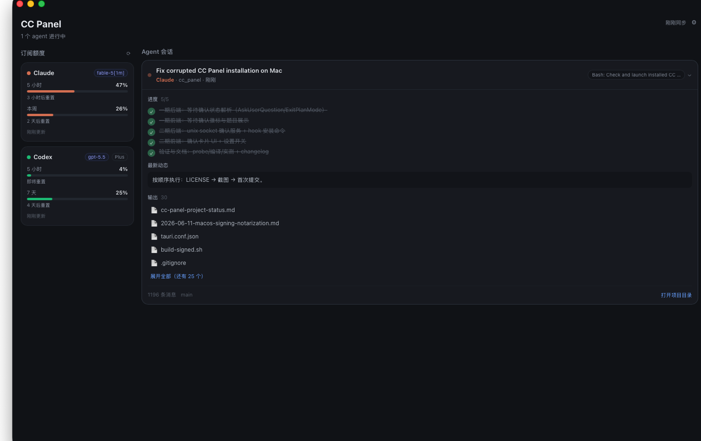

# CC Panel

[English](README.md) | 简体中文

> Claude Code / Codex 多会话监控面板 —— agent 们在各个终端里干活，你只需要看一眼菜单栏，就知道谁在跑、谁在等你、额度还剩多少。

macOS 菜单栏应用，Tauri 2 + Rust + Vue 3，安装包仅 ~4MB，全本地运行。



## 解决什么问题

重度使用 Claude Code / Codex 的人都遇到过：

- 开了三四个终端跑 agent，切来切去看进度，有的早就卡在权限确认上空等了半小时
- 干着干着突然"额度已用完"，事前毫无感知
- 想知道某个会话改了哪些文件、进行到哪一步，只能去终端里翻滚动历史

## 核心功能

### 📊 订阅额度实时可见

- Claude 5 小时 / 本周窗口用量、重置时间，进度条超阈值变色预警
- Codex 额度纯本地解析（读会话内 `rate_limits`），零额外网络请求
- 卡片显示当前使用的模型（如 `fable-5[1m]` / `gpt-5.5`）
- 自动识别第三方代理配置（`ANTHROPIC_BASE_URL` / 非默认 `model_provider`），不显示误导性的官方额度数字

### 👀 Agent 会话一屏总览

- 所有活跃会话：标题、项目、运行状态、当前正在做什么（如 `Edit: claude.rs`）
- 展开看详情：任务进度清单、最新动态、改动的文件列表（默认折叠前 5 个，点击直达 Finder）、git 分支

### ⏸ 等会话不如等通知

- 会话停在权限确认 / 选择题 / 计划批准上时：橙色「待确认」徽标自动置顶 + 菜单栏 `⏸ n` 计数 + 系统通知（带提示音）
- 会话结束同样有通知（基于约 2 分钟静默判定）
- 同一会话同类事件 10 分钟去重；设置页（⚙）两类通知独立开关

### ✅ 不切终端，直接批准

- 通过 Claude Code 官方 PreToolUse hook 机制，工具权限确认直接出现在面板里，点「允许 / 拒绝」即生效
- 45 秒不操作自动回落终端原生提示；面板关着完全无感
- 安全闸门：面板窗口不可见直接放过（零延迟）、会话路径真实性校验、特殊权限模式放过、命中 allowlist 的命令放过——**任何异常只会回落终端，绝不缺省放行**
- 设置页一键安装/卸载 hook（写 `~/.claude/settings.json` 前自动备份）

### 🔒 安全设计

- 全本地运行：OAuth token 只在内存中使用，不落盘、不写日志、不返回前端
- 不开任何 TCP 端口；hook 通信走 unix socket（目录 0700 / socket 0600，仅本用户）
- 唯一网络请求是 Anthropic 官方额度接口（GET，10s 超时，失败静默降级）
- 发布版已完成 Apple Developer ID 签名 + 公证，安装不会报"已损坏"

## 安装

从 Release 下载 DMG，拖入 Applications 即可（已签名公证，无需任何 xattr 操作）。

要启用「面板内批准」：打开面板 → 右上角 ⚙ → 勾选「在面板中确认工具权限」→ 新开的 Claude Code 会话生效。

## 开发

```bash
pnpm install
pnpm tauri dev          # 开发运行
cargo run --example probe   # 无 GUI 验证数据解析（在 src-tauri 下执行）
```

签名+公证发布：复制 `scripts/build-signed.example.sh` 为 `scripts/build-signed.sh`（已 gitignore），填入自己的 Developer ID 签名身份与公证凭据后执行，产出 aarch64 / x86_64 两个已公证 DMG。

数据源：`~/.claude/projects/**/*.jsonl`（Claude 会话）、`~/.codex/sessions/**/*.jsonl`（Codex 会话）、Claude OAuth usage 端点（额度）。

## 已知边界

- AskUserQuestion 的选择题只能在面板**看到**，作答仍需回终端（CLI 从自身 TTY 读输入，无注入通道）
- Codex 没有等价的 hook 决策机制，确认类功能仅支持 Claude Code
- 会话结束通知有约 2 分钟延迟（mtime 静默判定的固有属性）
